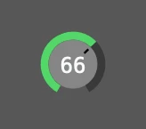
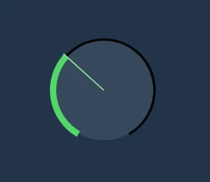

# Vue Control Knob

Fully customizable rotary control knob component for Vue 3 that behaves like native audio app controls in Logic Pro or
Ableton Live. Component is rendered as an ARIA-friendly SVG element.

 

## Features

- Supports **keyboard, mouse & wheel control**
- Changes input only with **vertical mouse movement**
- **Precise mode** using shift + movement
- **Reset to default** with Option-click (alt-click)
- **Zero dependencies** (apart from Vue 3)
- **Fully configurable** and **Tailwind CSS -friendly** styles
- Witten in **TypeScript**, ships with typings

## Controls

| Interaction                     | Action                                                    |
| ------------------------------- | --------------------------------------------------------- |
| Drag vertically                 | Change the value (drag up to increase, down to decrease). |
| Shift + drag                    | Precise mode — finer changes per pixel.                   |
| Mouse wheel                     | Change the value by `wheelFactor` (or by 1 with Shift).   |
| Arrow keys (Up/Right/Down/Left) | Change the value by `keyFactor` (or by 1 with Shift).     |
| Home / End                      | Jump to the minimum / maximum value.                      |
| Option-click (Alt-click)        | Reset to `defaultValue`.                                  |

## Installation

1. Install `@slipmatio/control-knob` package from npm
2. Import the Vue component into your project: `import ControlKnob from '@slipmatio/control-knob'`
3. Configure `v-model` and options

### Usage

```vue
<script setup lang="ts">
import { ref } from 'vue'
import ControlKnob from '@slipmatio/control-knob'
import type { ControlKnobOptions } from '@slipmatio/control-knob'

const value = ref(0)

const options: ControlKnobOptions = {
  minValue: 0,
  maxValue: 12,
  step: 0.01,
  formatValue: (v) => v.toFixed(1),
}
</script>

<template>
  <ControlKnob v-model="value" :options="options" />
</template>
```

The `ControlKnobOptions` type is exported for full type safety.

### Configuration

**All configuration options are optional**. The options referencing inner coordinate positions are based on a 100x100
coordinate system that is not affected by `imageSize`.

| Option           | Default                              | Description                                                                            |
| ---------------- | ------------------------------------ | -------------------------------------------------------------------------------------- |
| imageSize        | 40                                   | Rendered SVG width and height in pixels.                                               |
| minValue         | 0                                    | Minimum value of the knob v-model.                                                     |
| maxValue         | 100                                  | Maximum value of the knob v-model.                                                     |
| defaultValue     | 0                                    | Value restored on Option-click (alt-click) / reset.                                    |
| step             | 0                                    | Snaps the value to multiples of this increment (e.g. `0.01`). `0` keeps it continuous. |
| formatValue      | `(v) => String(Math.round(v))`       | Formats the displayed value and `aria-valuetext`.                                      |
| showTick         | true                                 | Show visible marker of the knob position.                                              |
| showValue        | true                                 | Show value label inside the knob.                                                      |
| hideDefaultValue | true                                 | Hide value label if value equals `defaultValue`.                                       |
| tickLength       | 18                                   | Tick length in pixels.                                                                 |
| tickOffset       | 10                                   | Tick offset in pixels.                                                                 |
| tickStroke       | 3                                    | Tick stroke width.                                                                     |
| rimStroke        | 11                                   | Outer rim stroke width.                                                                |
| valueArchStroke  | 11                                   | Value arch stroke width.                                                               |
| bgRadius         | 34                                   | Radius of the background circle.                                                       |
| wheelFactor      | 10                                   | Modifier to factor any mousewheel ticks.                                               |
| keyFactor        | 10                                   | Modifier to factor any arrow-key presses.                                              |
| tabIndex         | 0                                    | Tabindex for the HTML element.                                                         |
| ariaLabel        | 'Knob'                               | ARIA label for the HTML element.                                                       |
| valueTextX       | 50                                   | X-position (center) of the value text label.                                           |
| valueTextY       | 50                                   | Y-position (center) of the value text label.                                           |
| fontSize         | 30                                   | Font size of the value text, in viewBox units.                                         |
| svgClass         | 'select-none'                        | CSS class for the SVG element.                                                         |
| bgClass          | 'text-[#868686]'                     | CSS class for the background circle.                                                   |
| rimClass         | 'text-[#393939]'                     | CSS class for the outer rim.                                                           |
| valueArchClass   | 'text-[#53d769]'                     | CSS class for the value arch.                                                          |
| tickClass        | 'text-black'                         | CSS class for the tick line.                                                           |
| valueTextClass   | 'text-gray-50 font-normal font-mono' | CSS class for the value text.                                                          |
| passiveEvents    | false                                | When set, propagation of handled events is not prevented.                              |

**Note** that if you're using Tailwind CSS with automatic purge, you'll probably want to add the default classes as
options so PurgeCSS catches them (or you can just whitelist them):

Default Tailwind CSS classes:

```js
const options = {
  svgClass: 'select-none',
  bgClass: 'text-[#868686]',
  rimClass: 'text-[#393939]',
  valueArchClass: 'text-[#53d769]',
  tickClass: 'text-black',
  valueTextClass: 'text-gray-50 font-normal font-mono',
}
```

## Development

### Install dependencies

`pnpm i`

### Run development server

`pnpm dev`

### Run tests

`pnpm test`

## Contributing

Contributions are welcome! Please follow the
[code of conduct](https://www.contributor-covenant.org/version/2/0/code_of_conduct/) when interacting with others.

## Elsewhere

- Follow [@uninen on X](https://x.com/uninen) or [uninen.net on Bluesky](https://bsky.app/profile/uninen.net)
- Read my learnings around Vue / TypeScript and other Web dev topics from my
  [Today I Learned blog](https://til.unessa.net/)
- If you speak Finnish, check out [Koneoppiblogi](https://koneoppiblogi.uninen.net)
